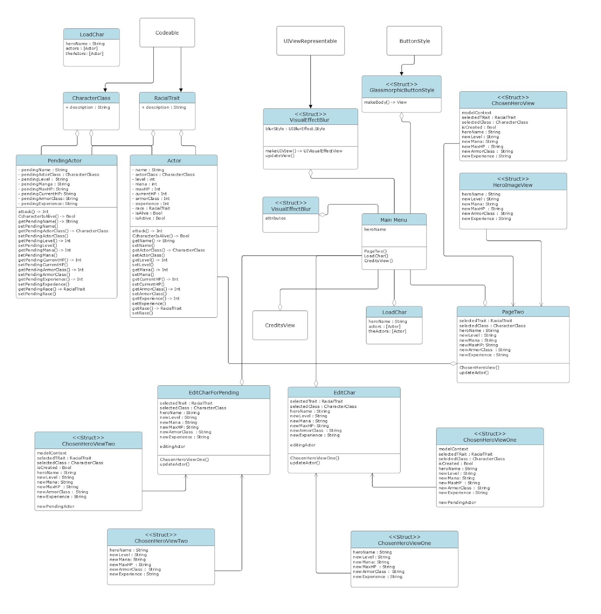
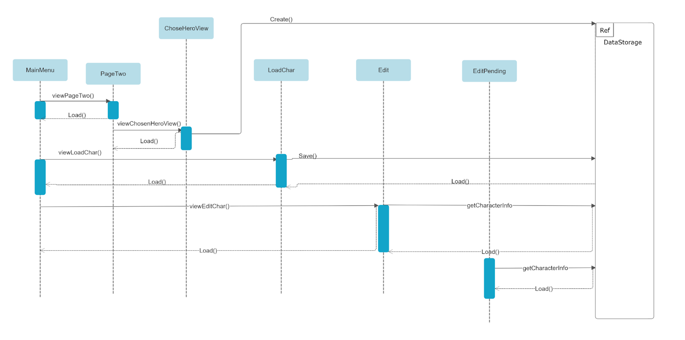
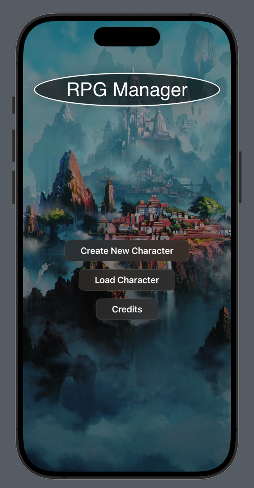
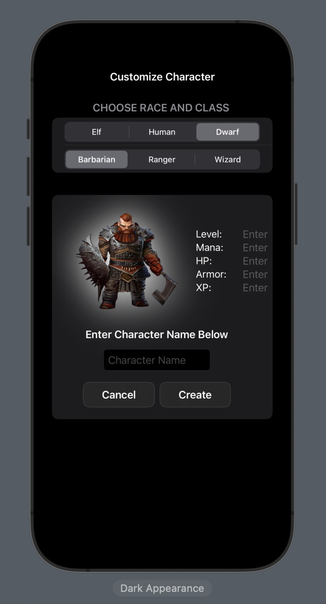
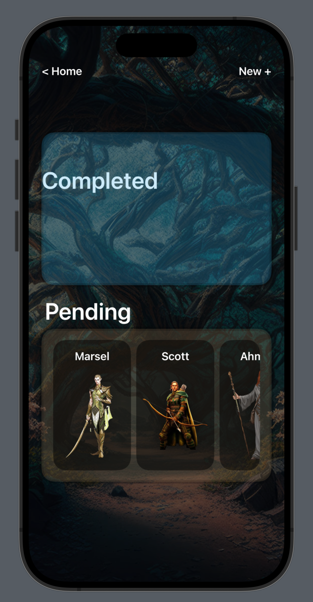
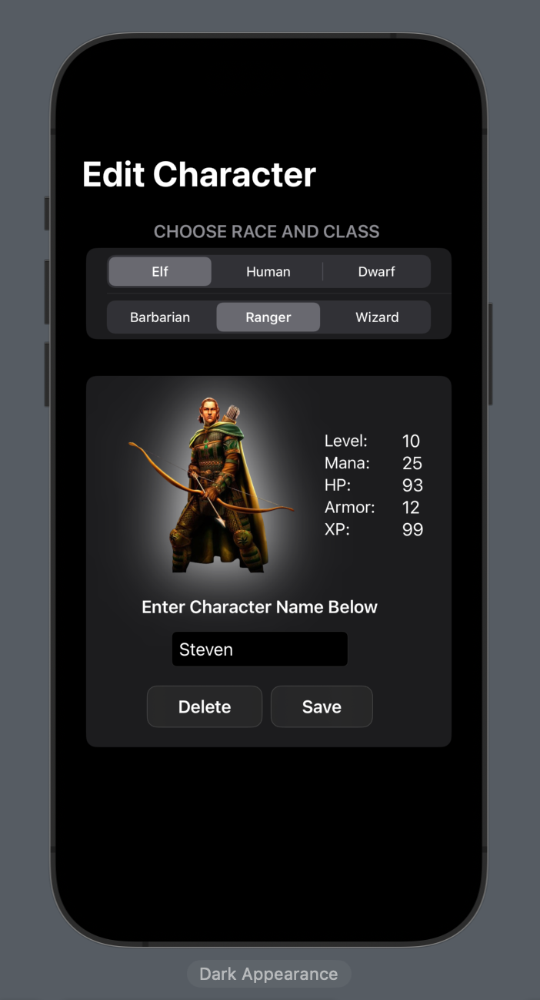

##  Introduction

While role-playing games (RPG) such as Final Fantasy have been going on for a while in the gaming industry, it is essential for the player to be able to customize their character. For instance, perhaps the player wants their character to be more or less representative of their characteristics, like as precise as a ranger or as magical and mysterious as a wizard. Therefore, recognizing such personal tastes, our group has decided to allow the players to manage and customize their own characters in the games they are playing via a portable device such as a phone.
 
## Objective

The objective of this project is to create a manager app for playable characters in an RPG. We want the manager to add new classes and be able to store information for future use. We aimed to create an all-around manager system that can be scaled up with more inherent information.

## Project High-Level Design

On a high-level approach, the following characteristics are displayed:

The main menu is meant for the user to traverse through the app. It connects to a create new character view, a loaded character, and a credits view.

We have a create new character view (PageTwo) that has a lot of UI information that loads relevant attribute fields and creates the object itself storing it in local data.

The load character button reads saved data to load for future use.

We can also edit previously created characters, both finished and unfinished, by loading the character onto an edit screen

Credits are low resource text view that contains information about who contributed to the project.

## Class Diagram

## Sequence Diagram

## Screenshots
   

## Design Patterns

- **Factory Method Pattern**: We used the factory method design pattern to create actor objects with certain attributes from the PageTwo method. It stores those attributes of the playable classes in the object adding some specific functionality to the object.
- **Model-View-ViewModel (MVVM)**:  Our main UI elements, PageTwo, LoadChar, and MainMenu resemble the MVVM pattern. The views are responsible for displaying the UI, while ViewModels from the @State and @Binding handle the presentation logic and data binding. 
@State variables such as selectedTrait, selectedClass, and heroName in PageTwo.swift manages the state of the UI components and can be updated.
- **Repository Pattern**: The Actor class serves as a repository for character data. It encapsulates the data and behavior related to playable characters, providing a single source for managing character-related information.
- **Observer/Observable Pattern**: SwiftUI extensively leverages the observer/observable pattern for managing UI state. 
For example, the ‘@State’ syntax triggers the UI to update automatically.
- **Builder Pattern**: SwiftUI uses a declarative syntax to construct views, which form the builder pattern. The views are composed hierarchically, with each component responsible for its own configuration and layout, building the overall app.

## Instructions

1. Clone repository
2. Open project file

